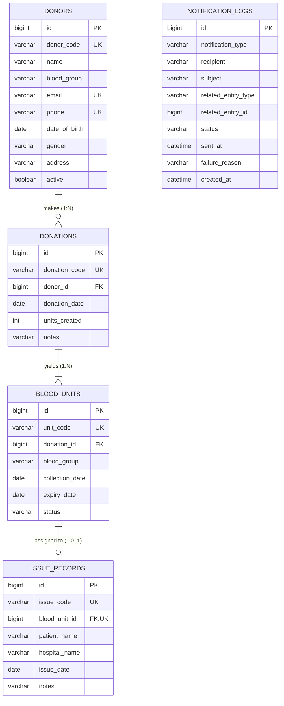

# Blood Bank Inventory & Donor Eligibility Tracker

> A Spring Boot REST API and integrated clinical web application for donor eligibility, blood donation processing, inventory lifecycle management, expiry tracking and FEFO blood issuing.

[](https://github.com/jagetheswaren/bloodbank/actions/workflows/ci.yml)
[](https://openjdk.org/projects/jdk/21/)
[](https://spring.io/projects/spring-boot)
[](https://www.mysql.com/)
[](pom.xml)
[](pom.xml)

---

## 1. Project Overview
**BloodBank** is an enterprise-grade medical inventory management system designed for regional blood centers, hospital transfusion departments, and voluntary donor registries. It replaces vulnerable paper-based ledgers and unverified spreadsheets with an automated, transactional Spring Boot system backed by MySQL and an integrated human-designed responsive web interface.

The system manages the complete lifecycle of blood donation: donor profile management, automated 90-day donation interval calculations, physical blood unit generation with 42-day shelf lives, real-time inventory aggregation across all 8 human blood groups, continuous near-expiry auto-flagging, and patient-safe FEFO (First Expire, First Out) blood allocation.

---

## 2. Problem Statement
Local and regional blood banks frequently rely on manual paper records or unverified spreadsheets, leading to critical operational and clinical risks:
1. **Donor Health Risks**: Inability to strictly enforce mandatory medical recovery intervals (90 days) leads to premature repeat donations.
2. **Inventory Wastage**: Difficulty identifying units nearing expiration before they spoil.
3. **Clinical Transfusion Hazards**: Risk of issuing expired, near-expiry, or incompatible blood to patients under emergency pressures.
4. **Duplicate Issuing**: Lack of database-level concurrency controls allows a single physical unit to be erroneously assigned to multiple recipients.
5. **Lack of Real-Time Stock Visibility**: Inability to instantly assess available stock levels across blood groups during trauma emergencies.

---

## 3. Key Features
- **Integrated Web Interface**: Clean, clinical, human-designed Thymeleaf & Vanilla JS frontend (`/`, `/dashboard`, `/donors`, `/donations`, `/inventory`, `/issues`, `/about`).
- **Donor Management**: Full CRUD with soft-deactivation (preserving historical clinical records).
- **90-Day Eligibility Guard**: Strict service-layer validation enforcing the mandatory 90-day recovery interval before accepting blood units.
- **Atomic Donation Processing**: One donation session automatically generates $N$ uniquely coded blood units (`UNT-...`) within an atomic `@Transactional` boundary.
- **Configurable 42-Day Shelf Life**: Automatically computes expiration dates (default: 42 days from collection).
- **Real-Time Stock Counter**: Returns live counts for all 8 blood groups (`A+`, `A-`, `B+`, `B-`, `AB+`, `AB-`, `O+`, `O-`), ignoring unusable units.
- **7-Day Expiry Auto-Flagging**: Proactively transitions safe `AVAILABLE` units to `NEAR_EXPIRY` when within 7 days of expiry.
- **FEFO Blood Issuing**: Selects the earliest-expiring safe units first to minimize inventory spoilage.
- **Duplicate Issuing Prevention**: Database unique constraints (`UNIQUE (blood_unit_id)`) guarantee no blood unit can ever be issued twice.
- **Centralized Error Handling**: Standardized `@RestControllerAdvice` error responses with zero stack-trace leakage.
- **Interactive OpenAPI / Swagger UI**: Built-in interactive documentation and endpoint testing at `/swagger-ui/index.html`.

---

## 4. Technology Stack

| Technology | Version | Role in Project |
| :--- | :--- | :--- |
| **Java** | 21 LTS | Core modern programming language with virtual threads and records. |
| **Spring Boot** | 4.1.1 | Primary application framework for dependency injection, REST APIs, and embedded Tomcat. |
| **Spring Data JPA** | 4.1.1 | Data access abstraction providing repository implementations and JPQL queries. |
| **Hibernate ORM** | 7.x | Object-relational mapping engine managing entity persistence, schema, and transactions. |
| **Jakarta Validation** | 3.x | Declarative bean validation enforcing constraints on API input DTOs. |
| **MySQL & HikariCP** | 8.0.x | Enterprise relational database with high-performance JDBC connection pooling. |
| **Thymeleaf** | 3.1.x | Server-side template engine for the integrated clinical web interface. |
| **Springdoc OpenAPI** | 2.8.5 | Automated Swagger UI and OpenAPI 3.0 specification generator. |
| **JUnit 5 & Mockito** | 5.x | Automated unit and integration testing framework (46 automated tests). |
| **H2 In-Memory DB** | 2.x | High-speed zero-dependency database used exclusively for automated test execution and CI. |
| **Project Lombok** | 1.18.x | Compile-time boilerplate reduction for getters, setters, and constructors. |
| **Apache Maven** | 3.9+ | Build automation, dependency management, and multi-profile packaging. |

---

## 5. System Architecture

The application implements a clean layered architecture ensuring separation of concerns:

```text
Client / Web UI / Swagger UI
        ↓  (HTTP JSON / Form Requests)
Controller Layer (RestController & WebViewController)
        ↓  (Jakarta Validation / DTOs)
Service Layer (DonorService, DonationService, InventoryService, IssueService)
        ↓  (Eligibility Verification, FEFO Sorting, Spring @Transactional)
Repository Layer (Spring Data JPA)
        ↓  (Hibernate ORM / JPQL Queries)
HikariCP Connection Pool
        ↓
MySQL Database (InnoDB, Foreign Keys, Unique Indexes)
```

Detailed architectural diagrams and sequence flows are documented in [docs/ARCHITECTURE.md](docs/ARCHITECTURE.md).

---

## 6. Database Architecture

The relational schema consists of 4 normalized operational tables and 1 notification audit table managed by Hibernate with foreign key and unique constraints:



Detailed relational design and indexes are documented in [docs/DATABASE_DESIGN.md](docs/DATABASE_DESIGN.md).

---

## 7. Business Rules

1. **90-Day Donor Eligibility Interval**: Voluntary donors must complete a 90-day recovery gap between whole blood donations. Any donation attempt prior to 90 days is rejected with HTTP 400 (`DONOR_NOT_ELIGIBLE`).
2. **42-Day Blood Unit Shelf Life**: Every unit of whole blood expires exactly 42 days from collection (`collectionDate + 42 days`).
3. **7-Day Near-Expiry Window**: Blood units within 7 days of expiry are isolated as `NEAR_EXPIRY` and excluded from issueable stock.
4. **First-Expire, First-Out (FEFO) Allocation**: Blood requests query safe available units ordered by `expiryDate ASC, id ASC`, ensuring the oldest viable unit is issued first.
5. **Double Issue Prevention**: Enforced via database constraint `UNIQUE (blood_unit_id)` on `issue_records`.
6. **Soft Donor Deactivation**: Deactivating a donor prevents future donations while preserving historical donation and inventory records.

---

## 8. Project Structure

```text
bloodbank/
├── .github/
│   └── workflows/
│       └── ci.yml                 # Automated CI: compile, test, package
├── docs/                          # Comprehensive technical documentation
│   ├── ARCHITECTURE.md            # System architecture specification
│   ├── DATABASE_DESIGN.md         # Relational schema and DDL
│   ├── API_DOCUMENTATION.md       # Complete REST API reference
│   ├── UI_UX_GUIDE.md             # Frontend design system and UI specs
│   ├── ASSESSMENT_GUIDE.md        # Academic assessment rubrics
│   ├── DEMO_GUIDE.md              # Demonstration workflows
│   ├── VIVA_QUESTIONS.md          # Viva voce Q&A preparation
│   ├── PROJECT_BUILD_EXPLANATION.md # Component connection map
│   ├── LOCAL_DEMO_GUIDE.md        # Localhost execution procedures
│   └── diagrams/                  # Mermaid architecture and sequence diagrams
├── scripts/
│   ├── start_app.ps1              # Production startup launcher
│   └── test_all_localhost.ps1     # Automated end-to-end verification suite
├── src/
│   ├── main/
│   │   ├── java/com/bloodbank/
│   │   │   ├── config/            # OpenAPI configuration
│   │   │   ├── controller/        # REST and Web View controllers
│   │   │   ├── dto/               # Request, Response, and Page DTOs
│   │   │   ├── entity/            # JPA Entities (Donor, Donation, BloodUnit, IssueRecord)
│   │   │   ├── enums/             # BloodGroup, BloodUnitStatus, Gender
│   │   │   ├── exception/         # Custom exceptions and GlobalExceptionHandler
│   │   │   ├── repository/        # Spring Data JPA repositories
│   │   │   ├── scheduler/         # Automated inventory status scheduler
│   │   │   ├── service/           # Domain business logic & transactions
│   │   │   └── BloodbankApplication.java
│   │   └── resources/
│   │       ├── static/            # CSS design system & client JS modules
│   │       │   ├── css/           # variables, base, layout, components, pages, animations
│   │       │   └── js/            # api.js, ui.js, dashboard.js, donors.js, donations.js, inventory.js, issues.js
│   │       ├── templates/         # Thymeleaf server-rendered HTML templates
│   │       │   ├── fragments/     # sidebar, navbar, footer, alerts
│   │       │   ├── index.html     # Landing page
│   │       │   ├── dashboard.html # Clinical dashboard with KPI cards and stock tiles
│   │       │   ├── donors.html    # Donors table and search
│   │       │   ├── donor-form.html # Register donor form
│   │       │   ├── donor-details.html # Donor profile with full eligibility panel
│   │       │   ├── donations.html # Donations history
│   │       │   ├── donation-form.html # Guided donation workflow with eligibility check
│   │       │   ├── inventory.html # All blood units inventory
│   │       │   ├── near-expiry.html # 7-day near-expiry monitor
│   │       │   ├── expired.html   # Expired units quarantine list
│   │       │   ├── issue-blood.html # FEFO blood issuing form
│   │       │   ├── issues.html    # Issue records audit history
│   │       │   └── about.html     # Architecture and rules overview
│   │       └── application.properties
│   └── test/
│       ├── java/com/bloodbank/    # 46 Automated unit and integration tests
│       └── resources/
│           └── application-test.properties # H2 in-memory test configuration
├── .env.example                   # Environment variable template
├── .gitignore                     # Git exclusion rules
├── mvnw / mvnw.cmd                # Apache Maven wrappers
└── pom.xml                        # Maven project descriptor (v1.0.0)
```

---

## 9. REST API Overview

| Method | Endpoint | Description | Response Code |
| :--- | :--- | :--- | :--- |
| `POST` | `/api/donors` | Register new donor | `201 Created` |
| `GET` | `/api/donors` | List donors (paginated, filterable) | `200 OK` |
| `GET` | `/api/donors/{id}` | Get donor profile | `200 OK` |
| `PUT` | `/api/donors/{id}` | Update donor contact details | `200 OK` |
| `DELETE`| `/api/donors/{id}` | Soft-deactivate donor | `204 No Content` |
| `GET` | `/api/donors/{id}/eligibility` | Evaluate 90-day donation eligibility | `200 OK` |
| `POST` | `/api/donations` | Atomically register donation & create units | `201 Created` |
| `GET` | `/api/donations` | List donations (paginated) | `200 OK` |
| `GET` | `/api/donations/{id}` | Get donation session details | `200 OK` |
| `GET` | `/api/donations/donor/{donorId}` | List donations for specific donor | `200 OK` |
| `GET` | `/api/inventory` | List all inventory units | `200 OK` |
| `GET` | `/api/inventory/stock` | Real-time usable stock by blood group | `200 OK` |
| `GET` | `/api/inventory/near-expiry` | Units within 7-day near-expiry cutoff | `200 OK` |
| `GET` | `/api/inventory/expired` | Expired units past 42 days | `200 OK` |
| `GET` | `/api/inventory/blood-group/{bg}` | Filter inventory by blood group | `200 OK` |
| `GET` | `/api/inventory/unit/{unitCode}` | Search single unit by code | `200 OK` |
| `POST` | `/api/issues` | Allocate and issue blood unit via FEFO | `201 Created` |
| `GET` | `/api/issues` | List all issue records | `200 OK` |
| `GET` | `/api/issues/{id}` | Get issue record details | `200 OK` |
| `GET` | `/api/notifications` | List recent email notification audit logs | `200 OK` |
| `GET` | `/api/notifications/status` | Get email notification subsystem status | `200 OK` |

Interactive Swagger documentation is available at `http://localhost:8080/swagger-ui/index.html`.

---

## 10. Prerequisites & Installation

### Prerequisites
- **Java Development Kit (JDK)**: Java 21 or higher
- **Database**: MySQL 8.0 Server (or Docker container)
- **Maven**: Included via `./mvnw` / `.\mvnw.cmd` wrapper

### Local Setup
1. **Clone Repository**:
   ```bash
   git clone https://github.com/jagetheswaren/bloodbank.git
   cd bloodbank
   ```

2. **Configure MySQL Database**:
   Create the database schema in MySQL:
   ```sql
   CREATE DATABASE IF NOT EXISTS bloodbank_db;
   ```

3. **Set Environment Variables**:
   In PowerShell:
   ```powershell
   $env:DB_USERNAME="root"
   $env:DB_PASSWORD="YOUR_MYSQL_PASSWORD"
   $env:SERVER_PORT="8080"
   ```
   Or create a `.env` file from `.env.example`.

4. **Run Application**:
   ```powershell
   .\mvnw.cmd spring-boot:run
   ```

5. **Access Application**:
   - Web Portal: [http://localhost:8080](http://localhost:8080)
   - Clinical Dashboard: [http://localhost:8080/dashboard](http://localhost:8080/dashboard)
   - Swagger UI: [http://localhost:8080/swagger-ui/index.html](http://localhost:8080/swagger-ui/index.html)
   - OpenAPI Spec: [http://localhost:8080/v3/api-docs](http://localhost:8080/v3/api-docs)

---

## 11. Automated Testing & Packaging

Automated testing executes against an embedded in-memory H2 database, requiring no active MySQL instance:

```powershell
# Run 46 automated unit and integration tests
.\mvnw.cmd clean test

# Build production executable JAR
.\mvnw.cmd clean package
```

The resulting executable JAR will be located at:
```text
target/bloodbank-1.0.0.jar
```

To run the packaged release JAR directly:
```powershell
java -jar target/bloodbank-1.0.0.jar
```

---

## 12. Security & Compliance
- **No Hardcoded Secrets**: Datasource credentials are injected via environment variables (`DB_USERNAME`, `DB_PASSWORD`).
- **Input Sanitization**: Jakarta Bean Validation enforces strict format validation on all DTO parameters.
- **SQL Injection Immune**: All database operations use JPA parameter-bound prepared statements.
- **Zero Stack-Trace Leakage**: `GlobalExceptionHandler` converts technical exceptions into structured, sanitized error messages.

---

## 13. Documentation Index
- [Architecture Blueprint](docs/ARCHITECTURE.md)
- [Database Schema & Relational Design](docs/DATABASE_DESIGN.md)
- [REST API Reference](docs/API_DOCUMENTATION.md)
- [UI/UX Design Specification](docs/UI_UX_GUIDE.md)
- [Project Build Connection Map](docs/PROJECT_BUILD_EXPLANATION.md)
- [Assessment Rubric Guide](docs/ASSESSMENT_GUIDE.md)
- [Demo Presentation Script](docs/DEMO_GUIDE.md)
- [Viva Voce Q&A Preparation](docs/VIVA_QUESTIONS.md)
- [Localhost Execution Guide](docs/LOCAL_DEMO_GUIDE.md)
- [Mermaid Diagrams](docs/diagrams/)
