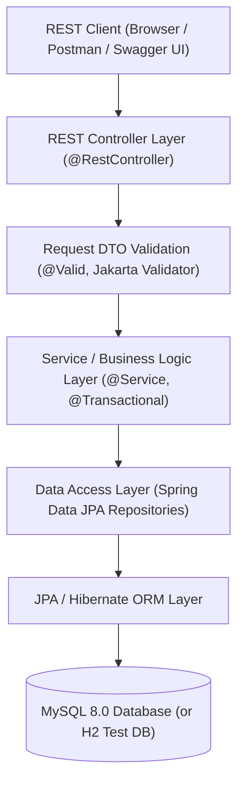
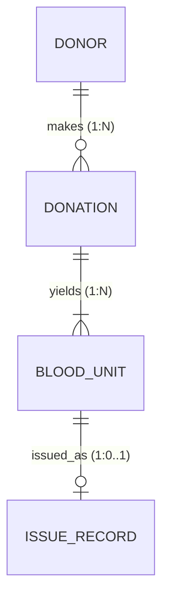

# BloodBank — Blood Bank Inventory and Donor Eligibility Tracker

[](https://openjdk.org/projects/jdk/21/)
[](https://spring.io/projects/spring-boot)
[](https://www.mysql.com/)
[](LICENSE)
[](pom.xml)

---

## 1. Project Overview
**BloodBank** is an enterprise-grade backend system designed for regional blood banks, hospital transfusion centers, and donor registries. It replaces vulnerable paper-based and spreadsheet tracking with a secure, automated, transactional Spring Boot backend.

The system manages the end-to-end lifecycle of blood donation: donor profile management, automated 90-day donation interval calculations, physical blood unit generation with 42-day shelf lives, real-time inventory aggregation across all 8 human blood groups, continuous near-expiry auto-flagging, and patient-safe FEFO (First Expire, First Out) blood issuing.

---

## 2. Problem Statement
Local and regional blood banks frequently rely on manual paper records or unverified spreadsheets. This creates critical operational and clinical challenges:
1. **Donor Health Risks**: Inability to strictly enforce mandatory medical recovery intervals between donations leads to premature repeat donations.
2. **Inventory Wastage**: Difficulties identifying units nearing expiration before they spoil.
3. **Clinical Transfusion Hazards**: High risk of issuing expired, near-expiry, or incompatible blood to patients under emergency pressures.
4. **Duplicate Issuing**: Lack of database-level concurrency controls allows a single physical unit to be erroneously assigned to multiple recipients.
5. **Lack of Real-Time Stock Visibility**: Inability to instantly assess available stock levels across blood groups during natural disasters or trauma emergencies.

---

## 3. Objective
To construct a robust, highly reliable backend system that:
- Maintains an accurate, audited database of donors, donations, individual blood containers, and hospital issue logs.
- Strictly calculates donor eligibility in the **Service Layer** *prior* to persisting donations.
- Automates shelf-life tracking (42 days) and proactively flags units within 7 days of expiration (`NEAR_EXPIRY`).
- Enforces patient-safe **FEFO (First Expire, First Out)** issuing, completely blocking expired, near-expiry, or already-issued units.
- Operates under a clean layered architecture with 100% automated test verification.

---

## 4. Features
- **Donor Management**: Full CRUD with soft-deactivation (preserving historical clinical records).
- **Eligibility Engine**: Enforces configurable minimum donation gaps (default: 90 days) before any database write.
- **Atomic Donation Processing**: One donation session automatically generates $N$ uniquely coded blood units (`UNT-...`) within an atomic `@Transactional` boundary.
- **Configurable Shelf Life**: Automatically computes expiration dates (default: 42 days).
- **Real-Time Stock Counter**: Returns live counts for all 8 blood groups (`A+`, `A-`, `B+`, `B-`, `AB+`, `AB-`, `O+`, `O-`), ignoring unusable units.
- **7-Day Expiry Auto-Flagging**: Automatically transitions safe `AVAILABLE` units to `NEAR_EXPIRY` when within 7 days of expiry.
- **FEFO Blood Issuing**: Selects the earliest-expiring safe units first to minimize inventory spoilage.
- **Duplicate Issuing Prevention**: Database unique constraints (`UNIQUE (blood_unit_id)`) guarantee no blood unit can ever be issued twice.
- **Centralized Error Handling**: Standardized `@RestControllerAdvice` error responses with zero stack-trace leakage.
- **Interactive OpenAPI / Swagger UI**: Built-in interactive documentation and endpoint testing.

---

## 5. Technology Stack
- **Language**: Java 21 (compiled with Oracle JDK 26 using `-release 21`)
- **Framework**: Spring Boot 4.1.1
- **Persistence**: Spring Data JPA, Hibernate ORM 7.x
- **Database (Production/Dev)**: MySQL 8.0 Server
- **Database (Testing)**: H2 In-Memory Database (MySQL compatibility mode)
- **API Documentation**: SpringDoc OpenAPI 2.8.5 / Swagger UI
- **Validation**: Jakarta Bean Validation (Hibernate Validator)
- **Utilities**: Project Lombok, Jackson Databind JSR-310
- **Testing**: JUnit 5, Spring Boot Test, Mockito, MockMvc
- **Build Tool**: Apache Maven 3.9.16 via Maven Wrapper (`mvnw.cmd`)

---

## 6. System Architecture

The application adopts a conventional multi-tier enterprise layered architecture:



Key Architectural Principles:
1. **Thin Controllers**: Controllers only receive HTTP requests, trigger validation, and return DTOs.
2. **Fat Services**: All business rules (eligibility, shelf-life calculation, FEFO querying) reside strictly in the service layer.
3. **No Entity Leakage**: JPA Entities are never returned directly through REST controllers; typed DTOs are used exclusively.
4. **Declarative Transactions**: `@Transactional` ensures atomic commits and automatic rollbacks on failure.

---

## 7. Package Structure

```
com.bloodbank
├── BloodbankApplication.java        # Spring Boot main entrypoint & @EnableScheduling
├── config
│   ├── BloodBankProperties.java     # Configurable business properties (@ConfigurationProperties)
│   ├── OpenApiConfig.java           # OpenAPI Swagger configuration
│   └── WebCorsConfig.java           # Controlled CORS configuration
├── controller
│   ├── DonationController.java      # /api/donations endpoints
│   ├── DonorController.java         # /api/donors endpoints
│   ├── InventoryController.java     # /api/inventory endpoints
│   └── IssueController.java         # /api/issues endpoints
├── dto
│   ├── request
│   │   ├── DonationCreateRequest.java
│   │   ├── DonorCreateRequest.java
│   │   ├── DonorUpdateRequest.java
│   │   └── IssueRequest.java
│   └── response
│       ├── BloodUnitResponse.java
│       ├── DonationResponse.java
│       ├── DonorResponse.java
│       ├── EligibilityResponse.java
│       ├── ErrorResponse.java
│       ├── IssueRecordResponse.java
│       ├── IssueResponse.java
│       └── StockResponse.java
├── entity
│   ├── BloodUnit.java               # blood_units table
│   ├── Donation.java                # donations table
│   ├── Donor.java                   # donors table
│   └── IssueRecord.java             # issue_records table
├── enums
│   ├── BloodGroup.java              # A+, A-, B+, B-, AB+, AB-, O+, O- with JSON handlers
│   ├── BloodUnitStatus.java         # AVAILABLE, NEAR_EXPIRY, EXPIRED, ISSUED, DISCARDED
│   └── Gender.java                  # MALE, FEMALE, OTHER
├── exception
│   ├── BloodUnitUnavailableException.java
│   ├── BusinessRuleException.java
│   ├── DonorNotEligibleException.java
│   ├── DuplicateResourceException.java
│   ├── GlobalExceptionHandler.java  # Centralized @RestControllerAdvice
│   ├── InsufficientStockException.java
│   └── ResourceNotFoundException.java
├── repository
│   ├── BloodUnitRepository.java     # Index-optimized FEFO & stock queries
│   ├── DonationRepository.java      # Donor donation history queries
│   ├── DonorRepository.java         # Unique contact & code lookups
│   └── IssueRecordRepository.java   # Blood unit issuing audit queries
├── scheduler
│   └── InventoryStatusScheduler.java # Periodic status auto-flagging background job
└── service
    ├── DonationService.java         # Atomic donation & unit generation
    ├── DonorService.java            # Donor CRUD & 90-day gap eligibility
    ├── InventoryService.java        # Stock aggregation & status updates
    └── IssueService.java            # FEFO allocation & duplicate issue prevention
```

---

## 8. Database Design

The schema is normalized to **3NF / BCNF**, ensuring zero functional redundancy:

- **`donors`**: Stores donor profiles, contact data, and active flag.
- **`donations`**: Logs each physical donation event linked to a donor.
- **`blood_units`**: Represents discrete blood bags with independent barcodes, collection dates, and expiry dates.
- **`issue_records`**: Captures patient/hospital dispensing events, enforcing a strict 1:1 relationship with a blood unit.

### Schema Constraints & Optimization
- **Primary Keys**: Surrogate auto-incrementing BigInt IDs on all tables.
- **Foreign Keys**: `donations.donor_id → donors.id`, `blood_units.donation_id → donations.id`, `issue_records.blood_unit_id → blood_units.id`.
- **Unique Constraints**: `donor_code`, `email`, `phone`, `donation_code`, `unit_code`, `issue_code`, `blood_unit_id`.
- **Composite Index**: `(status, expiry_date)` on `blood_units` powers high-speed FEFO issuing and stock filtering.

---

## 9. Entity Relationships



- **Donor to Donation (1:N)**: A donor can donate multiple times over their lifetime.
- **Donation to BloodUnit (1:N)**: A single donation session produces one or more physical blood units.
- **BloodUnit to IssueRecord (1:0..1)**: A blood unit can be issued at most once. Once issued, the database constraint `UNIQUE (blood_unit_id)` permanently prevents re-issuance.

---

## 10. Business Rules

| Rule | Configuration Property | Default | Enforcement Details |
| :--- | :--- | :--- | :--- |
| **Minimum Donation Gap** | `bloodbank.donation.minimum-gap-days` | `90` days | Evaluated in `DonorService.checkEligibility()`. If `today < lastDonationDate + 90 days`, donation registration is rejected with HTTP 400. |
| **Unit Shelf Life** | `bloodbank.blood-unit.shelf-life-days` | `42` days | Computed upon donation creation: `expiryDate = collectionDate + 42 days`. |
| **Near-Expiry Threshold**| `bloodbank.inventory.near-expiry-days` | `7` days | Units with `expiryDate <= today + 7 days` are auto-flagged as `NEAR_EXPIRY`. |
| **Issuing Safety** | Hard-coded Clinical Safety | N/A | Units marked `NEAR_EXPIRY`, `EXPIRED`, `ISSUED`, or `DISCARDED` can **never** be issued. |
| **FEFO Allocation** | First Expire, First Out | N/A | Issue query orders units by `expiryDate ASC`, ensuring the oldest safe blood is consumed first. |
| **Zero-Stock Visibility**| All 8 Blood Groups | N/A | Stock endpoint always reports all 8 blood groups (`A+`, `A-`, `B+`, `B-`, `AB+`, `AB-`, `O+`, `O-`), displaying `0` for unstocked groups. |

---

## 11. Prerequisites
- **Operating System**: Windows 10/11, macOS, or Linux
- **Java Development Kit**: JDK 21+ (Tested and verified with JDK 26)
- **Database**: MySQL Server 8.0+ (optional for testing; H2 runs in-memory)
- **Memory**: Minimum 2 GB RAM available

---

## 12. MySQL Installation & Setup

1. Verify MySQL service is active on Windows:
   ```powershell
   Get-Service MySQL*
   ```
2. Or test TCP port connectivity:
   ```powershell
   Test-NetConnection -ComputerName localhost -Port 3306
   ```

---

## 13. Database Creation

Log into MySQL shell using PowerShell or Command Prompt:

```powershell
& 'C:\Program Files\MySQL\MySQL Server 8.0\bin\mysql.exe' -u root -p
```

Create the application database:
```sql
CREATE DATABASE IF NOT EXISTS bloodbank_db
CHARACTER SET utf8mb4
COLLATE utf8mb4_unicode_ci;

EXIT;
```

---

## 14. Environment Variables

Configure connection credentials in PowerShell before running (or rely on default settings):

```powershell
$env:DB_URL="jdbc:mysql://localhost:3306/bloodbank_db?createDatabaseIfNotExist=true&serverTimezone=UTC"
$env:DB_USERNAME="root"
$env:DB_PASSWORD="YOUR_MYSQL_PASSWORD"
$env:SERVER_PORT="8080"
```

---

## 15. How to Run on Windows

Navigate to the project root directory (`.../bloodbank/bloodbank`):

### Option A: Run with Local MySQL
```powershell
$env:DB_USERNAME="root"
$env:DB_PASSWORD="YOUR_MYSQL_PASSWORD"
.\mvnw.cmd spring-boot:run
```

### Option B: Run Standalone In-Memory (H2 Test Profile — Zero MySQL Needed)
```powershell
java -jar target\bloodbank-0.0.1-SNAPSHOT.jar --spring.profiles.active=test --server.port=8080
```

---

## 16. REST API Reference

| Verb | Path | Description |
| :--- | :--- | :--- |
| `POST` | `/api/donors` | Register new donor |
| `GET` | `/api/donors` | List donors (paginated, sortable) |
| `GET` | `/api/donors/{id}` | Get donor profile |
| `PUT` | `/api/donors/{id}` | Update donor details |
| `DELETE` | `/api/donors/{id}` | Soft deactivate donor |
| `GET` | `/api/donors/{id}/eligibility` | Check 90-day donation eligibility |
| `POST` | `/api/donations` | Record donation & generate units |
| `GET` | `/api/donations` | List donations |
| `GET` | `/api/donations/{id}` | Get donation by ID |
| `GET` | `/api/inventory` | List all inventory units |
| `GET` | `/api/inventory/stock` | Real-time stock for all 8 blood groups |
| `GET` | `/api/inventory/near-expiry` | View units expiring within 7 days |
| `GET` | `/api/inventory/expired` | View expired units |
| `GET` | `/api/inventory/blood-group/{bg}` | View units of specific blood group |
| `POST` | `/api/issues` | Issue blood units via FEFO |
| `GET` | `/api/issues` | View issuing audit history |
| `GET` | `/api/issues/{id}` | View issue record by ID |

---

## 17. Swagger / OpenAPI Documentation

Once started, explore and test the interactive API in your browser:
- **Swagger UI**: [http://localhost:8080/swagger-ui/index.html](http://localhost:8080/swagger-ui/index.html)
- **OpenAPI 3.1 JSON**: [http://localhost:8080/v3/api-docs](http://localhost:8080/v3/api-docs)

---

## 18. Automated Testing

Execute the comprehensive automated test suite (37 tests) using the bundled Maven wrapper:

```powershell
.\mvnw.cmd clean test
```

### Test Coverage Highlights:
- **Unit & Service Tests**: Donor CRUD, eligibility edge cases, atomic donation rollback, FEFO allocation, expiry detection, and scheduler execution.
- **MockMvc Integration Tests**: End-to-end HTTP pipeline tests validating JSON contracts, validation constraints, and transaction flows against in-memory H2.

---

## 19. Example End-to-End Workflow

```powershell
# 1. Register Donor
Invoke-RestMethod -Uri "http://localhost:8080/api/donors" -Method POST -ContentType "application/json" -Body '{"name":"John Doe","email":"john@example.com","phone":"+1234567890","dateOfBirth":"1995-05-20","gender":"MALE","bloodGroup":"O+","address":"123 Main St"}'

# 2. Check Eligibility (Should return eligible = true)
Invoke-RestMethod -Uri "http://localhost:8080/api/donors/1/eligibility" -Method GET

# 3. Record Donation of 2 Units
Invoke-RestMethod -Uri "http://localhost:8080/api/donations" -Method POST -ContentType "application/json" -Body '{"donorId":1,"donationDate":"2026-09-28","numberOfUnits":2}'

# 4. Check Real-Time Stock (Shows O+ = 2)
Invoke-RestMethod -Uri "http://localhost:8080/api/inventory/stock" -Method GET

# 5. Attempt Immediate Repeat Donation (Returns 400 DONOR_NOT_ELIGIBLE)
Invoke-RestMethod -Uri "http://localhost:8080/api/donations" -Method POST -ContentType "application/json" -Body '{"donorId":1,"donationDate":"2026-09-28","numberOfUnits":1}'

# 6. Issue 1 Unit to Hospital (FEFO)
Invoke-RestMethod -Uri "http://localhost:8080/api/issues" -Method POST -ContentType "application/json" -Body '{"bloodGroup":"O+","numberOfUnits":1,"patientName":"Jane Smith","hospitalName":"City Hospital"}'

# 7. Check Stock Again (Shows O+ decreased to 1)
Invoke-RestMethod -Uri "http://localhost:8080/api/inventory/stock" -Method GET
```

---

## 20. Troubleshooting

| Symptom | Cause | Solution |
| :--- | :--- | :--- |
| `release version 25 not supported` | Java target mismatch with default machine JDK | In `pom.xml`, `<java.version>21</java.version>` is targeted. `mvnw.cmd` automatically uses JDK 26 with `-release 21`. |
| `Access denied for user 'root'@'localhost'` | Local MySQL root has a password | Set `$env:DB_PASSWORD="YOUR_MYSQL_PASSWORD"` before running `mvnw spring-boot:run`. |
| `Unable to delete target\...` | Windows file lock held by IDE language server | `maven-clean-plugin` is configured with `<failOnError>false</failOnError>`. Alternatively, stop the IDE server or run without `clean`. |
| `Port 8080 already in use` | Another process is listening on 8080 | Set `$env:SERVER_PORT="8081"` or pass `--server.port=8081`. |

---

## 21. Demo Instructions
See the complete 5-minute presentation script in [`docs/DEMO_GUIDE.md`](docs/DEMO_GUIDE.md).

---

## 22. Assessment Mapping
See the rubric mapping in [`docs/ASSESSMENT_GUIDE.md`](docs/ASSESSMENT_GUIDE.md).

---

## 23. Viva Voce Preparation
See the full set of 42 oral examination questions and answers in [`docs/VIVA_QUESTIONS.md`](docs/VIVA_QUESTIONS.md).
