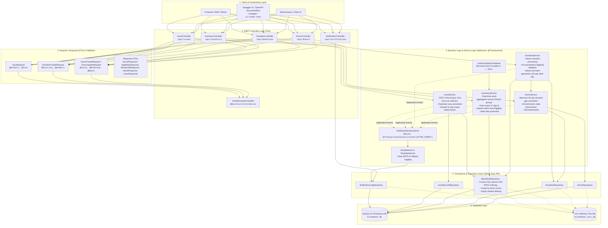

# System Architecture Documentation

## 1. Overview
The BloodBank Inventory and Donor Eligibility Tracker is engineered following standard enterprise layered architecture principles using **Spring Boot 4 / Java 21** and **Spring Data JPA / Hibernate** backed by **MySQL 8.0** (with an in-memory **H2** database for automated test suites).

The application enforces a strict separation of concerns:
- **Clients (Browser / Postman / Swagger UI)** interact solely through standardized RESTful JSON endpoints.
- **Controllers** remain thin orchestrators with zero business logic.
- **DTOs & Jakarta Bean Validation** ensure safe data contracts and boundary validation.
- **Service Layer** encapsulates all domain business logic (e.g., 90-day donor gap verification, 42-day blood unit shelf life, 7-day near-expiry auto-flagging, and FEFO blood allocation).
- **Repository Layer** provides high-performance data access queries leveraging database indexes.
- **Spring Data JPA / Hibernate** manages object-relational mapping, transactions, and relational integrity.

---

## 2. Layered Architecture Diagram

---

## 3. Component Details & Responsibility Matrix

| Layer | Component | Core Responsibilities |
| :--- | :--- | :--- |
| **Presentation** | `DonorController` | Handles HTTP routing for donor CRUD, soft delete, and eligibility queries. No business logic. |
| | `DonationController` | Handles donation registration requests and donation history. |
| | `InventoryController` | Exposes inventory units, stock level maps across 8 blood groups, near-expiry units, and expired units. |
| | `IssueController` | Receives blood issuing requests and returns issued unit audits. |
| | `NotificationController` | Exposes notification audit logs and email dispatch subsystem status. |
| | `GlobalExceptionHandler` | Centralized `@RestControllerAdvice` intercepting domain and validation exceptions, returning standardized JSON error bodies. |
| **DTOs & Validation** | `dto.request.*` | Immutable data carriers annotated with Jakarta Bean Validation (`@NotNull`, `@NotBlank`, `@Email`, `@PastOrPresent`, `@Positive`, etc.). |
| | `dto.response.*` | API representations preventing JPA entity leaks and circular serialization. |
| **Business Logic** | `DonorService` | Enforces unique email/phone constraints, calculates minimum 90-day donation gap, and handles soft deactivation. |
| | `DonationService` | Validates donor eligibility **before** persistence, atomically persists donation records, and generates individual units with 42-day shelf life. |
| | `InventoryService` | Aggregates available stock across all 8 blood groups (ignoring expired, near-expiry, issued, or discarded blood), and executes status evaluations. |
| | `IssueService` | Implements FEFO (First Expire, First Out) selection of available units, blocks unsafe units, and prevents reissue. |
| | `InventoryStatusScheduler` | Background scheduled task periodically triggering status updates for units entering near-expiry or expired windows. |
| | `NotificationEventListener` | Asynchronous (`@Async`, `@TransactionalEventListener(AFTER_COMMIT)`) event handler decoupling email dispatches from database commits. |
| | `EmailService` | Production SMTP mail sender utilizing `JavaMailSender` and Thymeleaf template rendering with safe fallback logging. |
| **Data Access** | `repository.*` | Interfaces extending `JpaRepository` (`DonorRepository`, `DonationRepository`, `BloodUnitRepository`, `IssueRecordRepository`, `NotificationLogRepository`). |
| **Entities** | `entity.*` | JPA entities (`Donor`, `Donation`, `BloodUnit`, `IssueRecord`, `NotificationLog`) defining tables, relations, and database constraints. |
