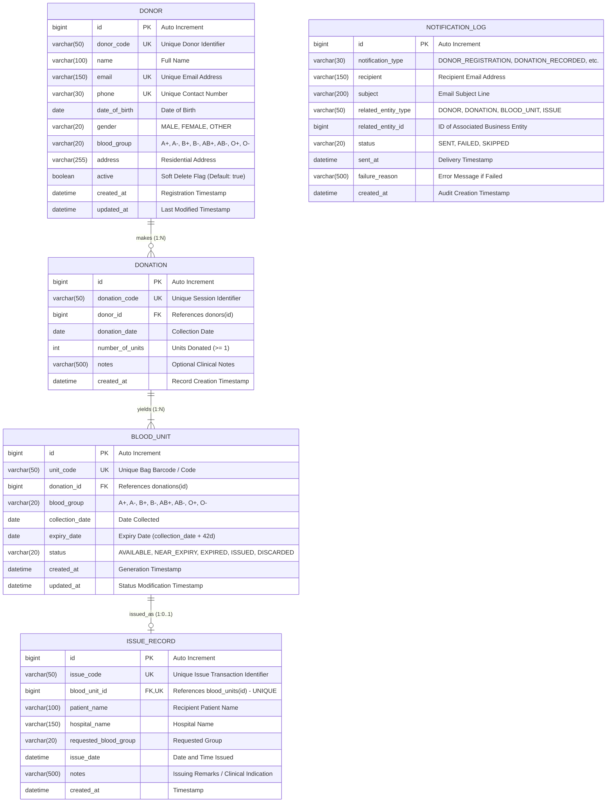

# Database Design Documentation

## 1. Overview
The BloodBank Inventory and Donor Eligibility Tracker uses a relational model designed in Boyce-Codd Normal Form (BCNF / 3NF) to guarantee data integrity, eliminate redundancy, and maximize query efficiency.

The database is composed of four central tables:
1. `donors`: Donor profiles, blood group, contact information, and active status.
2. `donations`: Event records representing individual donation sessions.
3. `blood_units`: Individual physical blood containers generated from a donation, each with a unique unit code, collection date, 42-day expiry date, and status.
4. `issue_records`: Audit log capturing the dispensing of a blood unit to a patient and hospital, ensuring a unit cannot be issued more than once.

---

## 2. Entity-Relationship (ER) Diagram



---

## 3. Relational Table Schemas & Constraints

### 3.1. `donors`
- **Primary Key**: `id`
- **Unique Constraints**:
  - `uk_donor_code`: `UNIQUE (donor_code)`
  - `uk_donor_email`: `UNIQUE (email)`
  - `uk_donor_phone`: `UNIQUE (phone)`
- **Indexes**:
  - `idx_donor_code` on `donor_code`
  - `idx_donor_email` on `email`
  - `idx_donor_phone` on `phone`
  - `idx_donor_blood_group` on `blood_group`

### 3.2. `donations`
- **Primary Key**: `id`
- **Foreign Key**: `donor_id` references `donors(id)` ON DELETE RESTRICT
- **Unique Constraints**:
  - `uk_donation_code`: `UNIQUE (donation_code)`
- **Indexes**:
  - `idx_donation_code` on `donation_code`
  - `idx_donation_donor_id` on `donor_id`
  - `idx_donation_date` on `donation_date`

### 3.3. `blood_units`
- **Primary Key**: `id`
- **Foreign Key**: `donation_id` references `donations(id)` ON DELETE RESTRICT
- **Unique Constraints**:
  - `uk_blood_unit_code`: `UNIQUE (unit_code)`
- **Indexes**:
  - `idx_bu_unit_code` on `unit_code`
  - `idx_bu_blood_group` on `blood_group`
  - `idx_bu_status` on `status`
  - `idx_bu_expiry_date` on `expiry_date`
  - `idx_bu_status_expiry` on `(status, expiry_date)` — Composite index heavily optimizing FEFO allocation and stock aggregation queries.

### 3.4. `issue_records`
- **Primary Key**: `id`
- **Foreign Key & Unique**: `blood_unit_id` references `blood_units(id)` ON DELETE RESTRICT `UNIQUE` (Enforces 1:1 issuing relationship at the physical database level).
- **Unique Constraints**:
  - `uk_issue_code`: `UNIQUE (issue_code)`
  - `uk_issue_blood_unit`: `UNIQUE (blood_unit_id)`
- **Indexes**:
  - `idx_issue_code` on `issue_code`
  - `idx_issue_unit_id` on `blood_unit_id`
### 3.5. `notification_logs`
- **Primary Key**: `id`
- **Indexes**:
  - `idx_notif_type` on `notification_type`
  - `idx_notif_status` on `status`
  - `idx_notif_recipient` on `recipient`
- **Purpose**: Tracks every outbound email event (e.g., registration welcome, donation acknowledgment, near-expiry warning, expired blood quarantine, issue alert) without storing sensitive credentials.

---

## 4. MySQL DDL Script

```sql
-- Database Creation
CREATE DATABASE IF NOT EXISTS bloodbank_db
CHARACTER SET utf8mb4
COLLATE utf8mb4_unicode_ci;

USE bloodbank_db;

-- 1. Donors Table
CREATE TABLE IF NOT EXISTS donors (
    id BIGINT AUTO_INCREMENT PRIMARY KEY,
    donor_code VARCHAR(50) NOT NULL,
    name VARCHAR(100) NOT NULL,
    email VARCHAR(150) NOT NULL,
    phone VARCHAR(30) NOT NULL,
    date_of_birth DATE NOT NULL,
    gender VARCHAR(20) NOT NULL,
    blood_group VARCHAR(20) NOT NULL,
    address VARCHAR(255),
    active BOOLEAN NOT NULL DEFAULT TRUE,
    created_at DATETIME NOT NULL,
    updated_at DATETIME NOT NULL,
    CONSTRAINT uk_donor_code UNIQUE (donor_code),
    CONSTRAINT uk_donor_email UNIQUE (email),
    CONSTRAINT uk_donor_phone UNIQUE (phone),
    INDEX idx_donor_code (donor_code),
    INDEX idx_donor_email (email),
    INDEX idx_donor_phone (phone),
    INDEX idx_donor_blood_group (blood_group)
) ENGINE=InnoDB;

-- 2. Donations Table
CREATE TABLE IF NOT EXISTS donations (
    id BIGINT AUTO_INCREMENT PRIMARY KEY,
    donation_code VARCHAR(50) NOT NULL,
    donor_id BIGINT NOT NULL,
    donation_date DATE NOT NULL,
    number_of_units INT NOT NULL,
    notes VARCHAR(500),
    created_at DATETIME NOT NULL,
    CONSTRAINT uk_donation_code UNIQUE (donation_code),
    CONSTRAINT fk_donation_donor FOREIGN KEY (donor_id) REFERENCES donors (id),
    INDEX idx_donation_code (donation_code),
    INDEX idx_donation_donor_id (donor_id),
    INDEX idx_donation_date (donation_date)
) ENGINE=InnoDB;

-- 3. Blood Units Table
CREATE TABLE IF NOT EXISTS blood_units (
    id BIGINT AUTO_INCREMENT PRIMARY KEY,
    unit_code VARCHAR(50) NOT NULL,
    donation_id BIGINT NOT NULL,
    blood_group VARCHAR(20) NOT NULL,
    collection_date DATE NOT NULL,
    expiry_date DATE NOT NULL,
    status VARCHAR(20) NOT NULL,
    created_at DATETIME NOT NULL,
    updated_at DATETIME NOT NULL,
    CONSTRAINT uk_blood_unit_code UNIQUE (unit_code),
    CONSTRAINT fk_blood_unit_donation FOREIGN KEY (donation_id) REFERENCES donations (id),
    INDEX idx_bu_unit_code (unit_code),
    INDEX idx_bu_blood_group (blood_group),
    INDEX idx_bu_status (status),
    INDEX idx_bu_expiry_date (expiry_date),
    INDEX idx_bu_status_expiry (status, expiry_date)
) ENGINE=InnoDB;

-- 4. Issue Records Table
CREATE TABLE IF NOT EXISTS issue_records (
    id BIGINT AUTO_INCREMENT PRIMARY KEY,
    issue_code VARCHAR(50) NOT NULL,
    blood_unit_id BIGINT NOT NULL,
    patient_name VARCHAR(100) NOT NULL,
    hospital_name VARCHAR(150) NOT NULL,
    requested_blood_group VARCHAR(20) NOT NULL,
    issue_date DATETIME NOT NULL,
    notes VARCHAR(500),
    created_at DATETIME NOT NULL,
    CONSTRAINT uk_issue_code UNIQUE (issue_code),
    CONSTRAINT uk_issue_blood_unit UNIQUE (blood_unit_id),
    CONSTRAINT fk_issue_blood_unit FOREIGN KEY (blood_unit_id) REFERENCES blood_units (id),
    INDEX idx_issue_code (issue_code),
    INDEX idx_issue_unit_id (blood_unit_id),
    INDEX idx_issue_date (issue_date)
) ENGINE=InnoDB;

-- 5. Notification Logs Table
CREATE TABLE IF NOT EXISTS notification_logs (
    id BIGINT AUTO_INCREMENT PRIMARY KEY,
    notification_type VARCHAR(30) NOT NULL,
    recipient VARCHAR(150) NOT NULL,
    subject VARCHAR(200) NOT NULL,
    related_entity_type VARCHAR(50),
    related_entity_id BIGINT,
    status VARCHAR(20) NOT NULL,
    sent_at DATETIME,
    failure_reason VARCHAR(500),
    created_at DATETIME NOT NULL,
    INDEX idx_notif_type (notification_type),
    INDEX idx_notif_status (status),
    INDEX idx_notif_recipient (recipient)
) ENGINE=InnoDB;
```

---

## 5. Normalization Justification

- **First Normal Form (1NF)**: All attributes contain atomic, indivisible values. No repeating groups or multi-valued attributes exist (e.g., individual blood units are stored as separate rows rather than an array column in donations).
- **Second Normal Form (2NF)**: The database is in 1NF and all non-key attributes are fully functionally dependent on the entire primary key (`id`).
- **Third Normal Form (3NF)**: The database is in 2NF and there are no transitive dependencies (`X -> Y` where `Y -> Z`). Donor attributes depend strictly on `donor_id`, not on `donation_id`.
- **Boyce-Codd Normal Form (BCNF)**: For every non-trivial functional dependency `X -> Y`, `X` is a superkey (e.g. `donor_code -> all donor attributes`, `email -> all donor attributes`).
